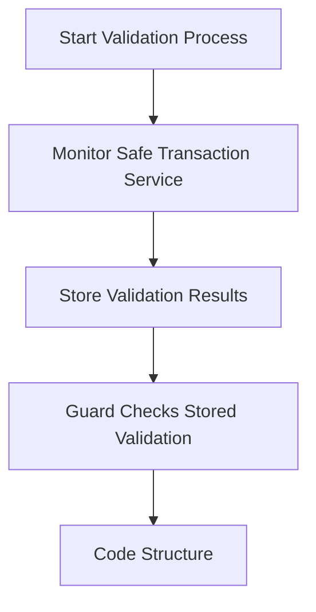

# Safe Guard + WAVS Demo

Status: _highly experimental and fun_

TODO:
- [ ] Use a better Safe Guard base like [borg-core](https://github.com/MetaLex-Tech/borg-core)
- [ ] A simple predicate function component
- [ ] Explore a cron trigger that pulls the Safe API

Reading and Resources:
- [Zodiac](https://www.zodiac.wiki/documentation): a bunch of useful extensions to the Safe. If you're looking for examples of extending Safe, Zodiac has a ton of them.
- [Safe Modules](https://docs.safe.global/advanced/smart-account-modules): documentation on Safe Modules, allowing easily extending functionality of a Safe.
- [Safe Guard](https://docs.safe.global/advanced/smart-account-guards): documentation on Safe Guards, allowing for checks on Safe transactions.

## Gnosis Safe Async Validation Summary

### Key Findings
- Pure async validation in Safe guards is not possible since checkTransaction must be synchronous
- A two-step validation process is required: validate first, then execute
- Validation state must be stored on-chain for the guard to access it
- Can leverage existing Safe events/APIs to improve UX by starting validation early via an AVS

### Triggering the Validation Process

There are a few approaches to triggering the validation process via an AVS.

1. **ApproveHash**

```solidity
event ApproveHash(bytes32 indexed approvedHash, address indexed owner)
```
- Emitted when an owner signs a transaction on-chain
- Can use this to trigger validation during signature collection
- Only works for on-chain signatures


2. **Safe Transaction Service APIs**

Pending Transaction Monitoring:
```
// Get pending transactions
GET /api/v1/safes/{address}/multisig-transactions/?executed=false

// Webhook payload for new proposals
{
    type: "PENDING_MULTISIG_TRANSACTION",
    safeTxHash: string,
    address: string
    // ...
}
```

Transaction Status:
```
// Get specific transaction
GET /api/v1/multisig-transactions/{safeTxHash}/
```

### Recommended Implementation Pattern



1. Monitor Safe Transaction Service for new proposals (via an AVS)
2. Start validation process immediately on new proposals
3. Store results on-chain via validation contract (custom Safe Guard)
4. Guard checks stored validation during execution

### Best Practices
- Include validation expiry timestamps
- Clean up old validation state
- Consider gas costs of storage
- Handle both on-chain and off-chain signature cases
- Start validation as early as possible in transaction lifecycle

This approach provides the best balance of security and UX while working within the constraints of the Safe's guard mechanism.

## Installation

Create a new project using this template:

```bash
# If you don't have forge: `curl -L https://foundry.paradigm.xyz | bash`
forge init --template Lay3rLabs/wavs-foundry-template my-wavs
```

### Solidity

```bash
# Initialize the submodule dependencies
forge install

# Build the contracts
forge build

# Run the solidity tests. alias: `make test`
forge test
```

> You can also use `make build` to build the contracts, bindings, and components.

## Rust

```bash
# Generate new bindings from your contract(s)
make bindings

# Run rust tests
make test
```

## WAVS

### Install the WAVS CLI

```bash
# MacOS: if you get permission errors: eval `ssh-agent -s` && ssh-add
(cd lib/WAVS; cargo install --path ./packages/cli)
```

### Start Anvil, WAVS, and Deploy Eigenlayer

```bash
# copy over the .env file
cp .env.example .env

# MacOS Docker:
# Docker Engine -> Settings -> Resources -> Network -> 'Enable Host Networking'
# or
# brew install chipmk/tap/docker-mac-net-connect && sudo brew services start chipmk/tap/docker-mac-net-connect
make start-all
```

### Build WASI components

> Install `cargo binstall cargo-component` if you have not already. -- https://github.com/bytecodealliance/cargo-component#installation

```bash
make wasi-build
```

### Deploy contracts

Deploy safe + custom guard.

``` bash
forge script script/SafeGuard.s.sol:DeploySafeGuardScript --rpc-url http://localhost:8545 --broadcast
```

Deploy core Eigen contracts:

``` bash
wavs-cli deploy-eigen-core
```

Deploy service manager:

``` bash
wavs-cli deploy-eigen-service-manager --service-handler $GUARD_ADDRESS
```

Set the `SERVICE_PROVIDER` environment variable with the address of the service manager. Load the environment variables:

``` bash
source .env
```

Initialize safe with service manager:

``` bash
forge script script/SafeGuard.s.sol:InitializeSafeGuardScript --rpc-url http://localhost:8545 --broadcast
```

Deploy component:

``` bash
wavs-cli deploy-service --trigger eth-contract-event \               
  --trigger-event-name $(cast sig-event "ApproveHash(bytes32, address)") \
  --trigger-address $SAFE_ADDRESS \                       
  --component ./compiled/dao_agent.wasm \
  --submit-address $SERVICE_PROVIDER \
  --service-config '{"fuelLimit":100000000,"maxGas":5000000,"hostEnvs":[],"kv":[],"workflowId":"default","componentId":"default"}'
```

Test the service:
```bash
forge script script/SafeGuard.s.sol:ApproveSafeTransactionScript --rpc-url http://localhost:8545 --broadcast
```